<div align="center">


# 🧬 MLOmics

### Latent-Fusion Multi-Omics Cancer Subtype Classifier

*End-to-end deep learning pipeline for precision oncology - classifying breast & colon cancer molecular subtypes from multi-omics genomic data*

[](https://github.com/deaneeth/multi-omics-cancer-subtype-classifier/actions/workflows/ci.yml)
[](LICENSE)
[](https://www.python.org/)
[](https://pytorch.org/)
[](https://streamlit.io/)
[](https://xgboost.readthedocs.io/)
[](https://shap.readthedocs.io/)
[](https://figshare.com/articles/dataset/MLOmics_Cancer_Multi-Omics_Database_for_Machine_Learning/28729127)
[]()
[]()

<br>

> ⚠️ **Academic research prototype - BSc Computer Science Final Year Project. Not for clinical use.**

<br>

[🚀 Quick Start](#-quick-start) · [🏗️ Architecture](#️-architecture) · [📊 Results](#-results) · [🔬 Explainability](#-explainability--biological-validation) · [🖥️ Demo App](#️-streamlit-demo-application) · [📂 Project Structure](#-project-structure) · [🔬 Key Findings](#-key-scientific-findings)

</div>

---

## 📖 Table of Contents

- [Overview](#-overview)
- [Cancer Cohorts & Dataset](#-cancer-cohorts--dataset)
- [Architecture](#️-architecture)
- [Quick Start](#-quick-start)
- [Full Pipeline](#️-full-pipeline)
- [Results](#-results)
- [Statistical Significance](#-statistical-significance)
- [Calibration Analysis](#-calibration-analysis)
- [Explainability & Biological Validation](#-explainability--biological-validation)
- [Ablation Studies](#-ablation-studies)
- [Streamlit Demo Application](#️-streamlit-demo-application)
- [Computational Requirements](#-computational-requirements)
- [Project Structure](#-project-structure)
- [Tech Stack](#️-tech-stack)
- [Key Scientific Findings](#-key-scientific-findings)
- [Known Limitations](#-known-limitations)
- [Citation & Data](#-citation--data)
- [Author](#-author)

---

## 🌟 Overview

**MLOmics** is a reproducible, end-to-end machine learning pipeline for **cancer molecular subtype classification** using multi-omics integration. It combines gene expression, microRNA, DNA methylation, and copy number variation data from 931 TCGA patients across two cancer cohorts - breast cancer (GS-BRCA, 5 subtypes) and colon cancer (GS-COAD, 4 subtypes) - to predict clinically actionable molecular subtypes that determine patient treatment.

The project evaluates five model families, from tree-based early-fusion baselines to a novel **pathway-aware intermediate fusion** architecture that injects KEGG biological pathway knowledge directly into the mRNA encoder. A **Streamlit demo application** ties everything together: real-time prediction, side-by-side model comparison, explainability visualisations, and a Lab Data Converter that processes hospital-format per-modality CSV files into prediction-ready format.

### Why This Matters

Cancer subtype misclassification using traditional protein tests (IHC, ~10–15% error rate) leads to wrong treatment - chemotherapy for patients who only need hormone therapy, or targeted therapy for patients whose biology doesn't support it. Multi-omics ML offers a path to higher-precision subtype determination using thousands of simultaneous genomic measurements.

---

## 🧫 Cancer Cohorts & Dataset

**Source:** [MLOmics Cancer Multi-Omics Database for Machine Learning](https://figshare.com/articles/dataset/MLOmics_Cancer_Multi-Omics_Database_for_Machine_Learning/28729127) (TCGA origin, CC-BY-4.0)

### GS-BRCA - Breast Cancer (671 patients, 15,366 features)

| Label | Molecular Subtype | Patients | % | Clinical Significance |
|:-----:|-------------------|:--------:|:---:|----------------------|
| 0 | **Basal-like** | 353 | 52.6% | Aggressive; often triple-negative; needs chemotherapy |
| 1 | **HER2-enriched** | 42 | 6.3% | HER2-driven; responds to Herceptin (trastuzumab) |
| 2 | **Luminal A** | 132 | 19.7% | Hormone-driven; slow-growing; tamoxifen alone often sufficient |
| 3 | **Luminal B** | 31 | 4.6% | Hormone-driven but faster-growing; needs hormone therapy + chemo |
| 4 | **Normal-like** | 113 | 16.8% | Resembles healthy breast tissue; generally good prognosis |

### GS-COAD - Colon Adenocarcinoma (260 patients, 15,200 features)

| Label | Molecular Subtype | Patients | % | Clinical Significance |
|:-----:|-------------------|:--------:|:---:|----------------------|
| 0 | **CMS1** (MSI/Immune) | 174 | 66.9% | High mutation rate; strong immune response; responds to immunotherapy |
| 1 | **CMS2** (Canonical) | 48 | 18.5% | Classic colon cancer biology; chromosomal instability |
| 2 | **CMS3** (Metabolic) | 34 | 13.1% | Metabolic dysregulation; mixed features |
| 3 | **CMS4** (Mesenchymal) | 4 | 1.5% | Worst prognosis; essentially unlearnable with 4 samples |

### The Four Omics Modalities

| Modality | Features (BRCA) | Features (COAD) | What It Measures |
|----------|:---------------:|:---------------:|-----------------|
| 🧬 **mRNA** | 5,000 | 5,000 | Gene expression - which genes are actively transcribed |
| 🔬 **miRNA** | 366 | 200 | MicroRNA regulation - post-transcriptional gene silencing |
| 🧪 **DNA Methylation** | 5,000 | 5,000 | Epigenetic silencing - which genomic regions are chemically tagged |
| 📊 **CNV** | 5,000 | 5,000 | Copy number variation - gene amplifications and deletions |

<table align="center" width="100%">
<tr>
<th align="center">GS-BRCA - Class Distribution (671 patients)</th>
<th align="center">GS-COAD - Class Distribution (260 patients)</th>
</tr>
<tr>
<td align="center">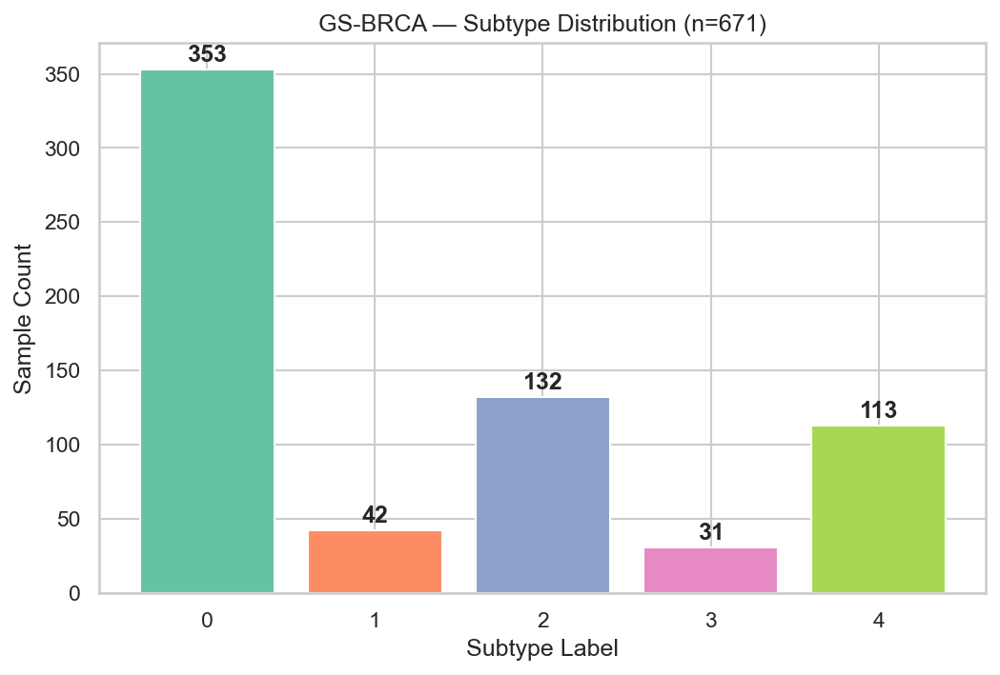</td>
<td align="center">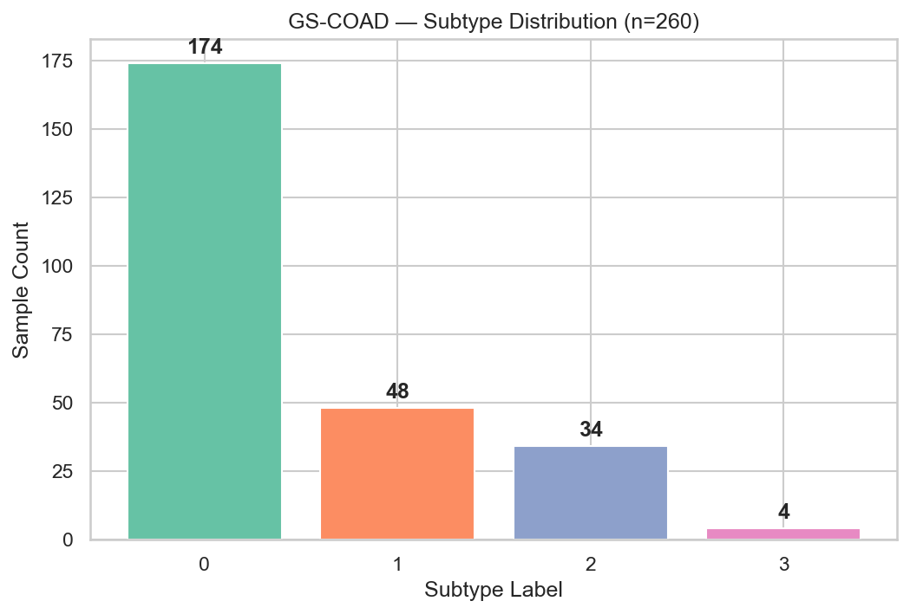</td>
</tr>
<tr>
<td colspan="2" align="center"><em>Class distribution across molecular subtypes. Note the severe CMS4 imbalance (4 patients, 1.5%) in GS-COAD.</em></td>
</tr>
</table>

<table align="center" width="100%">
<tr>
<th align="center">GS-BRCA - PCA of Preprocessed Features</th>
<th align="center">GS-COAD - PCA of Preprocessed Features</th>
</tr>
<tr>
<td align="center">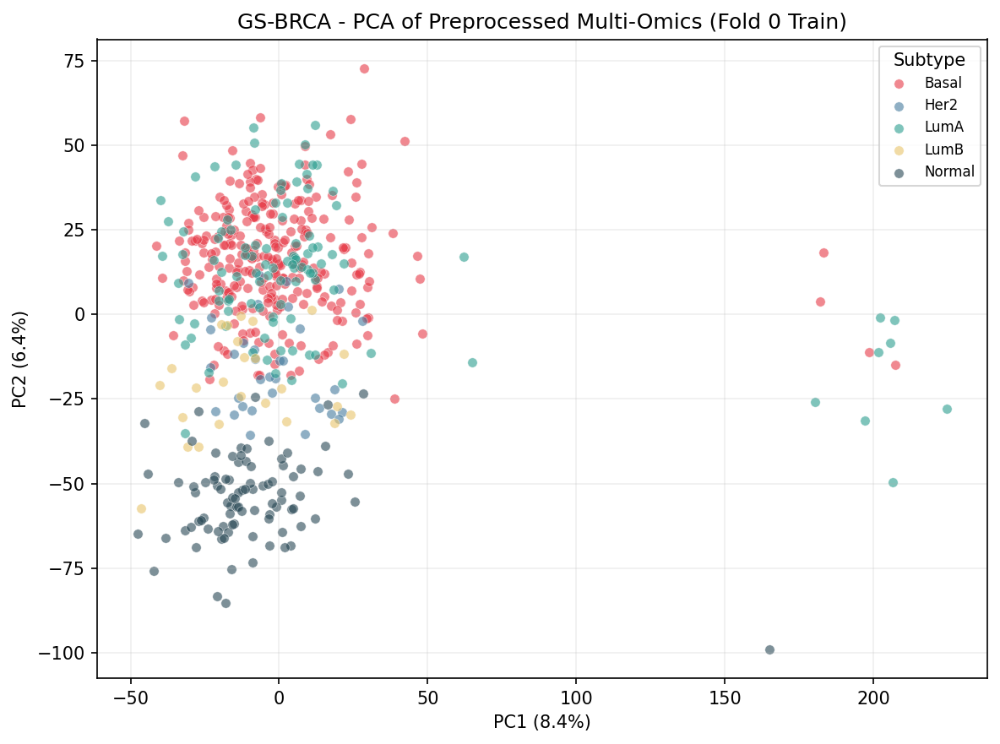</td>
<td align="center">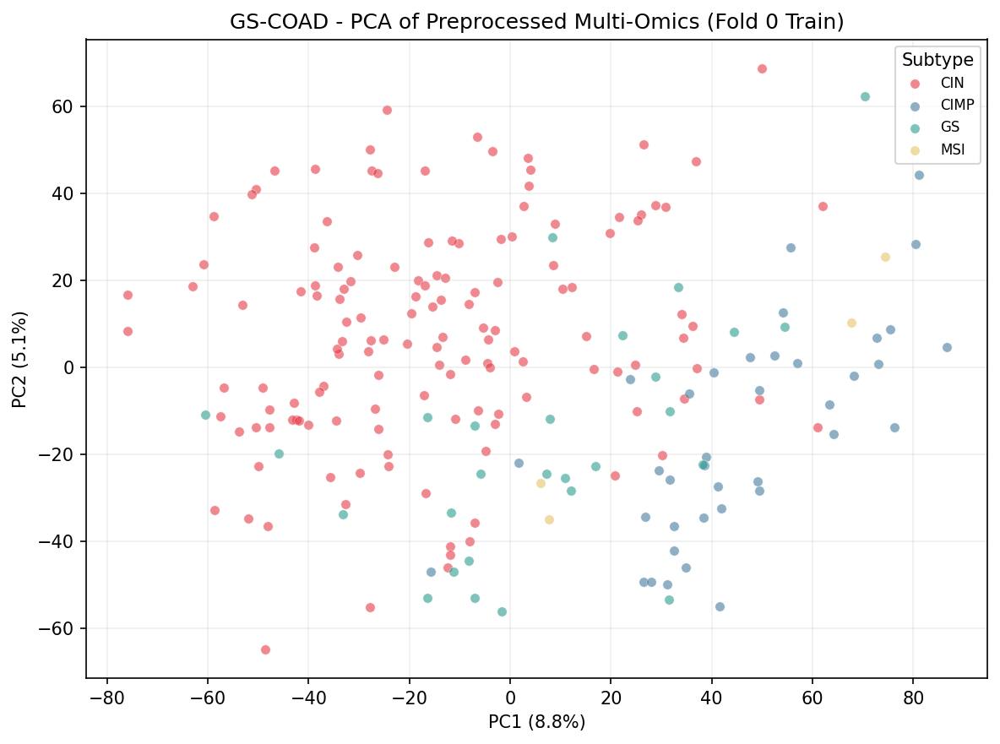</td>
</tr>
<tr>
<td colspan="2" align="center"><em>PCA of z-scored concatenated features post-preprocessing. Colour = ground-truth subtype. Cluster separation in PC1/PC2 reflects subtype discriminability before any model is applied.</em></td>
</tr>
</table>

> **Note:** 166 / 366 BRCA miRNA columns are entirely NaN (probes not assayed in BRCA cohort). Handled by `PerModalityImputer` (zero-fill after normalization).

---

## 🏗️ Architecture

### Model Overview

| Model | Type | Parameters | Notes |
|-------|------|:----------:|-------|
| **XGBoost** | Early-fusion tree baseline | ~300 trees | 300 estimators, max_depth=6, lr=0.1 |
| **Random Forest** | Early-fusion tree baseline | ~300 trees | 300 estimators, unlimited depth, class_weight=balanced |
| **EarlyFusionMLP** | Deep early-fusion ablation | - | input→256→128→classes (ablation only) |
| **IntermediateFusionModel** | Deep intermediate fusion | **4,036,613** | Per-modality encoders → latent concat → MLP |
| **PathwayAwareFusionModel** | Biology-guided fusion | **3,656,252** | KEGG dual-path mRNA encoder + standard modality encoders |

---

### IntermediateFusion Architecture

```
                         ┌──────────────────────────────────────────────────┐
                         │         IntermediateFusionModel                  │
                         │                                                  │
  mRNA (5,000) ─────────►│  ModalityEncoder                                 │
                         │  Linear(5000→256) → BN → ReLU → Dropout         │
                         │  Linear(256→64)   → BN → ReLU                   │──► 64-dim
                         │                                                  │     │
  miRNA (200/366) ───────►│  ModalityEncoder                                 │     │
                         │  Linear(366→256)  → BN → ReLU → Dropout         │──► 64-dim ─┐
                         │  Linear(256→64)   → BN → ReLU                   │            │
                         │                                                  │            ▼
  Methylation (5,000) ──►│  ModalityEncoder                                 │    cat(256-dim)
                         │  Linear(5000→256) → BN → ReLU → Dropout         │──► 64-dim  │
                         │  Linear(256→64)   → BN → ReLU                   │            │
                         │                                                  │            ▼
  CNV (5,000) ───────────►│  ModalityEncoder                                 │   FusionClassifier
                         │  Linear(5000→256) → BN → ReLU → Dropout         │──► 64-dim  │
                         │  Linear(256→64)   → BN → ReLU                   │            │
                         │                                                  │  Linear(256→128)
                         └──────────────────────────────────────────────────┘  → ReLU → Dropout
                                                                               Linear(128→classes)
                                                                                    │
                                                                             ┌──────▼──────┐
                                                                             │  Subtype ID  │
                                                                             └─────────────┘
```

---

### PathwayAwareFusion - The Novel Architecture

```
  mRNA (5,000) ──┬── Path A: KEGG Pathway Attention ─────────────────────┐
                 │   ┌─────────────────────────────────────────────┐     │
                 │   │  Group genes by KEGG pathway membership      │     │
                 │   │  (311 pathways, 35-37% coverage)             │     │
                 │   │  → Mean-pool per pathway → (batch, n_pw)     │     │
                 │   │  → Attention Net: Linear→Tanh→Linear→Softmax │     │
                 │   │  → Weighted sum → Linear(n_pw→64)→BN→ReLU    │──►64│
                 │   └─────────────────────────────────────────────┘     │
                 │                                               combiner │──► 64-dim
                 └── Path B: Unmapped Genes (~63%) ───────────────────────┘
                     Standard dense encoder → 64-dim

  miRNA ─────────────► Standard ModalityEncoder ──────────────────────────────► 64-dim
  Methylation ────────► Standard ModalityEncoder ──────────────────────────────► 64-dim ─► FusionClassifier
  CNV ────────────────► Standard ModalityEncoder ──────────────────────────────► 64-dim
```

**KEGG Coverage:** 35.18% (BRCA: 1,759 / 5,000 features, 311 pathways) · 37.48% (COAD: 1,874 / 5,000 features, 310 pathways)

---

## 🚀 Quick Start

```bash
# 1. Clone the repository
git clone https://github.com/deaneeth/multi-omics-cancer-subtype-classifier.git
cd multi-omics-cancer-subtype-classifier

# 2. Create the conda environment (Python 3.11)
conda create -n mlomics python=3.11 -y
conda activate mlomics

# 3. Install GPU PyTorch (CUDA 11.8)
pip install torch==2.7.1 --index-url https://download.pytorch.org/whl/cu118
pip install torchvision==0.22.1 --index-url https://download.pytorch.org/whl/cu118
pip install torchaudio --index-url https://download.pytorch.org/whl/cu118

# 4. Install all dependencies
pip install -r requirements.txt

# 5. Smoke test on toy data (no GPU, no download required)
python scripts/train_baselines.py --toy
python scripts/train_fusion.py --toy --epochs 5
python -m pytest tests/ -v

# 6. Launch the Streamlit demo (pre-trained artifacts included)
streamlit run app/streamlit_app.py
```

> **Reproducibility:** For full hash-order determinism, prefix training commands with `PYTHONHASHSEED=42` (Linux/macOS) or `$env:PYTHONHASHSEED=42;` (Windows PowerShell). `set_seeds(42)` handles NumPy/PyTorch internally.

---

<details>
<summary><strong>⚙️ Full Pipeline - Step-by-step training & evaluation commands</strong></summary>

## ⚙️ Full Pipeline

All commands must be run from the **repository root**. All hyperparameters live in [`config.yaml`](config.yaml).

### Step 1 - Download Data

Follow [`data/DATA_README.md`](data/DATA_README.md). Download from [Figshare](https://figshare.com/articles/dataset/MLOmics_Cancer_Multi-Omics_Database_for_Machine_Learning/28729127) into `data/raw/`:

```
data/raw/
├── GS-BRCA/Top/
│   ├── GS-BRCA_mRNA_top.csv
│   ├── GS-BRCA_miRNA_top.csv
│   ├── GS-BRCA_Methy_top.csv
│   └── GS-BRCA_cnv_top.csv
└── GS-COAD/Top/  (same pattern)
```

### Step 2 - Preprocess

```bash
jupyter nbconvert --to notebook --execute notebooks/01_preprocessing.ipynb
```

### Step 3 - Train Baselines

```bash
# XGBoost + RandomForest, 5-fold CV, both cancers
python scripts/train_baselines.py

# Individual models
python scripts/train_baselines.py --model xgb      # XGBoost only
python scripts/train_baselines.py --model rf --toy  # RF on toy data (fast)
```

### Step 4 - Train Deep Models

```bash
python scripts/train_fusion.py           # IntermediateFusion, both cancers
python scripts/train_pathway_fusion.py   # PathwayAwareFusion, both cancers
python scripts/train_fusion.py --toy --epochs 10   # Quick test
```

### Step 5 - Evaluate & Explain

```bash
python scripts/run_explainability.py      # SHAP + Integrated Gradients + KEGG/GO
python scripts/run_ablations.py           # Modality removal, fusion comparison, missing-data curves
python scripts/compute_auc.py             # AUC from all 40 saved models
python scripts/compute_significance_tests.py  # Wilcoxon + Cohen's d + 95% bootstrap CI
python scripts/calibration_analysis.py   # ECE, MCE, Brier score + reliability diagrams
python scripts/generate_roc_curves.py    # Per-fold ROC curves (BRCA)
python scripts/generate_roc_curves_coad.py  # Per-fold ROC curves (COAD)
```

### Step 6 - Prepare Demo

```bash
python scripts/prepare_demo_artifacts.py           # Export best-fold models → app/model_artifacts/
python scripts/precompute_fusion_attribution.py    # Pre-compute IG attributions for demo samples
python scripts/precompute_latent_space.py          # Pre-compute t-SNE embeddings
python scripts/create_demo_patients.py             # Sarah Mitchell (BRCA) + Robert Okonkwo (COAD)
python scripts/create_lab_patient_files.py         # Amara Nwosu lab-format files (Data Converter test)

streamlit run app/streamlit_app.py                 # 🚀 Launch at http://localhost:8501
```

### Optional - AI Research Summaries

```bash
# Set GROQ_API_KEY for AI-generated clinical context summaries after prediction
# Get a free key at https://console.groq.com

# Linux/macOS
export GROQ_API_KEY="gsk_your_key_here"
streamlit run app/streamlit_app.py

# Windows PowerShell
$env:GROQ_API_KEY = "gsk_your_key_here"
streamlit run app/streamlit_app.py

# Or add to .env file:
# GROQ_API_KEY=gsk_your_key_here
```

</details>

---

## 📊 Results

> **5-fold stratified cross-validation** (patient-level; identical splits across all models; `data/cv_folds.json`)  
> Evaluation protocol: no separate held-out test set. CV estimates carry mild optimistic bias from upstream ANOVA pre-selection (see [Known Limitations](#-known-limitations)).

### Primary Comparison Table (Macro F1 ± Std, AUC ± Std)

| Model | GS-BRCA F1 | GS-BRCA AUC | GS-BRCA Acc | GS-COAD F1 | GS-COAD AUC | GS-COAD Acc |
|-------|:----------:|:-----------:|:-----------:|:----------:|:-----------:|:-----------:|
| XGBoost | 0.794 ± 0.047 | 0.970 ± 0.015 | 0.864 ± 0.018 | 0.636 ± 0.115 | 0.911 ± 0.051 | 0.881 ± 0.063 |
| Random Forest | 0.602 ± 0.083 | **0.971 ± 0.009** | 0.782 ± 0.025 | 0.608 ± 0.073 | 0.932 ± 0.021 | 0.873 ± 0.029 |
| EarlyFusionMLP † | 0.722 ± 0.081 | - | - | 0.751 ± 0.100 | - | - |
| IntermediateFusion | **0.808 ± 0.050** | 0.963 ± 0.014 | 0.833 ± 0.050 | 0.669 ± 0.094 | 0.953 ± 0.008 | 0.839 ± 0.052 |
| PathwayAwareFusion | 0.801 ± 0.069 | 0.966 ± 0.017 | 0.829 ± 0.035 | **0.738 ± 0.142** | **0.954 ± 0.025** | **0.854 ± 0.060** |

† EarlyFusionMLP is an ablation baseline only - excluded from the primary `model_comparison.csv`.

**🏆 Best-fold checkpoints used in the demo app:**

- BRCA: XGBoost fold 3 · IntermediateFusion fold 3 · PathwayFusion fold 3 (F1 = 0.869)
- COAD: XGBoost fold 0 · IntermediateFusion fold 3 · PathwayFusion fold 1 (F1 = 0.913)

<table align="center" width="100%">
<tr>
<th align="center">GS-BRCA - Model Comparison (F1 per fold)</th>
<th align="center">GS-COAD - Model Comparison (F1 per fold)</th>
</tr>
<tr>
<td align="center">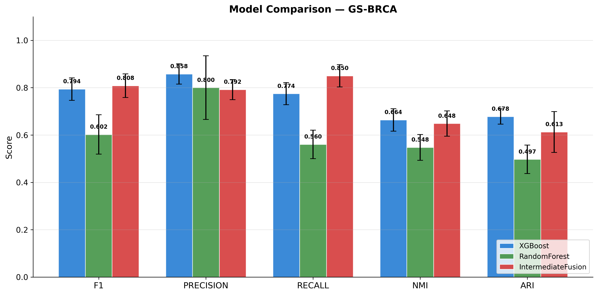</td>
<td align="center">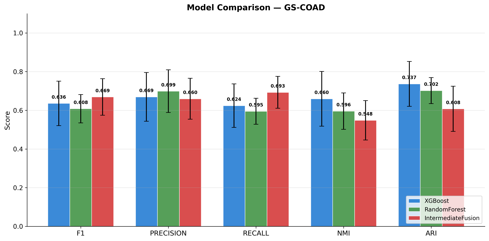</td>
</tr>
<tr>
<td colspan="2" align="center"><em>Macro F1 comparison across all 5 folds - GS-BRCA (left) and GS-COAD (right).</em></td>
</tr>
</table>

### Full Metrics Table (All Evaluation Dimensions)

| Model | Cancer | F1 | Precision | Recall | NMI | ARI | AUC | Accuracy |
|-------|--------|:--:|:---------:|:------:|:---:|:---:|:---:|:-------:|
| XGBoost | BRCA | 0.794 | 0.858 | 0.775 | 0.664 | 0.678 | 0.970 | 0.864 |
| RandomForest | BRCA | 0.602 | 0.800 | 0.560 | 0.548 | 0.497 | 0.971 | 0.782 |
| IntermediateFusion | BRCA | **0.808** | 0.792 | 0.850 | 0.649 | 0.613 | 0.963 | 0.833 |
| PathwayAwareFusion | BRCA | 0.801 | 0.791 | 0.827 | 0.643 | 0.597 | 0.966 | 0.829 |
| XGBoost | COAD | 0.636 | 0.669 | 0.624 | 0.660 | 0.737 | 0.911 | 0.881 |
| RandomForest | COAD | 0.608 | 0.699 | 0.595 | 0.596 | 0.702 | 0.932 | 0.873 |
| IntermediateFusion | COAD | 0.669 | 0.660 | 0.693 | 0.548 | 0.608 | 0.953 | 0.839 |
| PathwayAwareFusion | COAD | **0.738** | 0.726 | 0.766 | 0.594 | 0.637 | **0.954** | 0.854 |

> Source: `results/metrics/model_comparison.csv` + `results/metrics/auc_summary.csv`

---

## 📈 Statistical Significance

With 5 folds, the minimum achievable two-sided Wilcoxon p-value is **0.0625** - these tests are structurally underpowered. Effect sizes (Cohen's d) are the primary basis for practical claims.

> Source: `results/metrics/significance_tests.csv` · Generated by `scripts/compute_significance_tests.py` with 95% bootstrap CI (n=10,000 resamples)

| Comparison | ΔF1 | p-value | Cohen's d | Interpretation |
|------------|:---:|:-------:|:---------:|----------------|
| IntFusion vs XGBoost (BRCA) | +0.014 | 0.625 | 0.197 | ❌ Not significant; trivial effect - models are **comparable** |
| IntFusion vs RandomForest (BRCA) | +0.206 | 0.0625* | 1.888 | ✅ Significant at minimum threshold; very large effect |
| PathwayFusion vs IntFusion (COAD) | +0.069 | 0.3125 | 0.504 | ⚠️ Not significant; medium effect - practical gain |
| PathwayFusion vs XGBoost (COAD) | +0.102 | 0.3125 | 0.664 | ⚠️ Not significant; medium effect |

\* Minimum achievable p with n=5.

### 🔍 The AUC–F1 Paradox

Random Forest achieves the **highest AUC** (0.971) yet the **lowest F1** (0.602) on BRCA. IntermediateFusion shows the reverse: **lowest AUC** (0.963) but **highest F1** (0.808).

- **AUC** measures ranking ability: how well the model separates classes in probability space
- **F1** measures hard-decision quality: whether the model is right when forced to pick one class
- RF has excellent "intuition" (high AUC) but poor decision boundaries (recall=0.560, finding only 56% of positive cases)

This AUC–F1 divergence is a key thesis discussion point: evaluating medical models requires both metrics.

<table align="center" width="100%">
<tr>
<th align="center">GS-BRCA - Per-Fold ROC Curves</th>
<th align="center">GS-COAD - Per-Fold ROC Curves</th>
</tr>
<tr>
<td align="center">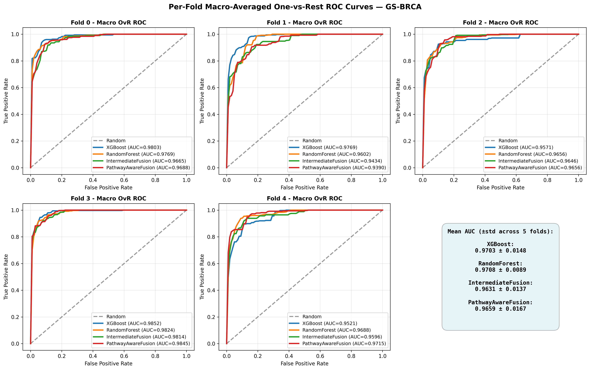</td>
<td align="center">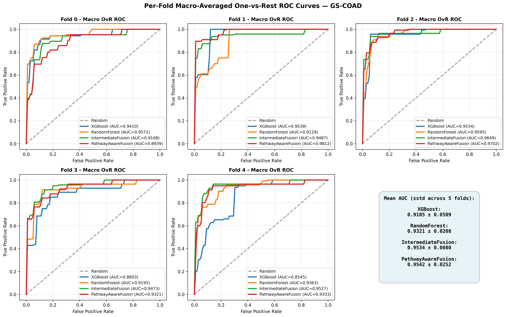</td>
</tr>
<tr>
<td colspan="2" align="center"><em>Per-fold macro-averaged ROC curves (OVR) - GS-BRCA (left) and GS-COAD (right).</em></td>
</tr>
</table>

---

## 📐 Calibration Analysis

Calibration measures whether a model's stated confidence scores match true empirical frequencies - a critical property for medical AI. A perfectly calibrated model that says "90% confident" should be right 90% of the time. **ECE** (Expected Calibration Error) is the primary metric; lower is better.

> Source: `results/calibration/calibration_summary.csv` · Generated by `scripts/calibration_analysis.py` (ECE, MCE, Brier score + reliability diagrams per fold)

| Model | BRCA ECE ↓ | BRCA Brier ↓ | COAD ECE ↓ | COAD Brier ↓ |
|-------|:----------:|:------------:|:----------:|:------------:|
| **XGBoost** | **0.068** | **0.040** | **0.068** | **0.050** |
| Random Forest | 0.145 | 0.060 | 0.135 | 0.057 |
| IntermediateFusion | 0.090 | 0.053 | 0.099 | 0.054 |
| PathwayAwareFusion | 0.073 | 0.051 | 0.074 | 0.057 |

> **Three-way disconnect:** XGBoost is the **best-calibrated** model on both cohorts. Random Forest is the **worst-calibrated** despite having the highest AUC (0.971). This creates a striking three-way split: RF ranks first in AUC, last in F1, and last in calibration. XGBoost ranks second in AUC, second in F1, and first in calibration - making it the most well-rounded model for clinical decision support, where calibrated confidence is as important as accuracy.

<table align="center" width="100%">
<tr>
<th align="center">XGBoost Reliability - GS-BRCA</th>
<th align="center">IntermediateFusion Reliability - GS-BRCA</th>
</tr>
<tr>
<td align="center">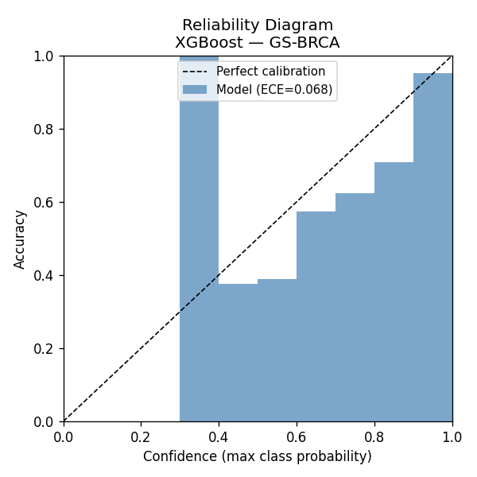</td>
<td align="center">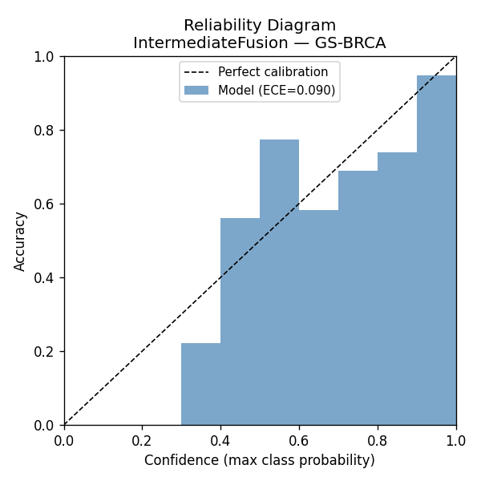</td>
</tr>
<tr>
<td colspan="2" align="center"><em>Reliability diagrams - GS-BRCA. XGBoost (left) shows near-diagonal calibration; IntermediateFusion (right) shows moderate deviation at high-confidence bins. A perfect model follows the diagonal.</em></td>
</tr>
</table>

---

## 🔬 Explainability & Biological Validation

### SHAP Feature Attribution (Tree Models)

**BRCA Top 5 XGBoost Features:**

| Rank | Feature | SHAP Score | Modality |
|:----:|---------|:----------:|---------|
| 1 | mrna_MLPH | 0.406 | mRNA |
| 2 | mrna_ESR1 *(Estrogen Receptor)* | 0.299 | mRNA |
| 3 | mrna_MPHOSPH6 | 0.258 | mRNA |
| 4 | mrna_TOP2A | 0.169 | mRNA |
| 5 | mrna_KCNMB1 | 0.167 | mRNA |

*All top-10 BRCA features are mRNA. First non-mRNA: `mirna_hsa.mir.130b` at rank 14.*

**COAD Top 5 XGBoost Features:**

| Rank | Feature | SHAP Score | Modality |
|:----:|---------|:----------:|---------|
| 1 | cnv_MYO5B | 0.252 | **CNV** |
| 2 | mrna_TIMM21 | 0.232 | mRNA |
| 3 | cnv_DCC | 0.186 | **CNV** |
| 4 | mrna_SLC35A4 | 0.167 | mRNA |
| 5 | methy_C4orf45 | 0.144 | **Methylation** |

*Multi-modal: CNV, mRNA, and methylation all in the top 5 for COAD.*

### Integrated Gradients (Deep Fusion Models)

> ⚠️ **Critical finding:** IntermediateFusion top-50 IG features are **entirely miRNA** for both BRCA and COAD - a signal of the miRNA over-weighting artifact documented in ablations.

PathwayAwareFusion IG attributions are stored separately in `pathway_fusion_attribution_results_{cancer}.json` and correctly loaded by the demo app.

### KEGG / GO Pathway Enrichment

| Model | Cancer | KEGG Significant | GO Significant | Top Pathway |
|-------|--------|:----------------:|:--------------:|-------------|
| XGBoost | BRCA | 0 | - | - |
| XGBoost | COAD | 0 | - | - |
| IntermediateFusion | **BRCA** | **4** | **57** | Cell cycle (p=3.07×10⁻⁵) |
| IntermediateFusion | COAD | 0 | 0 | - |

**IntermediateFusion BRCA KEGG Results:**

| Pathway | Adj. p-value | Key Genes |
|---------|:-----------:|----------|
| **Cell cycle** | 3.07×10⁻⁵ ✅ | CDC20, CCNB2, PTTG1, CCNE2, TTK, CDC25B |
| Oocyte meiosis | 7.26×10⁻³ | - |
| **p53 signaling pathway** | 1.29×10⁻² ✅ | CCNB2, CCNE2, GTSE1 |
| HTLV-1 infection | 2.61×10⁻² | - |

**GO Biological Process (57 significant terms) top hits:** microtubule cytoskeleton organization in mitosis · mitotic spindle organization · kinetochore organization - all mitosis-related, biologically plausible for a cancer classifier.

### Pathway Attention Weights

<table align="center" width="100%">
<tr>
<th align="center">Top-10 KEGG Pathway Attention - GS-BRCA</th>
<th align="center">Top-10 KEGG Pathway Attention - GS-COAD</th>
</tr>
<tr>
<td align="center" width=56%">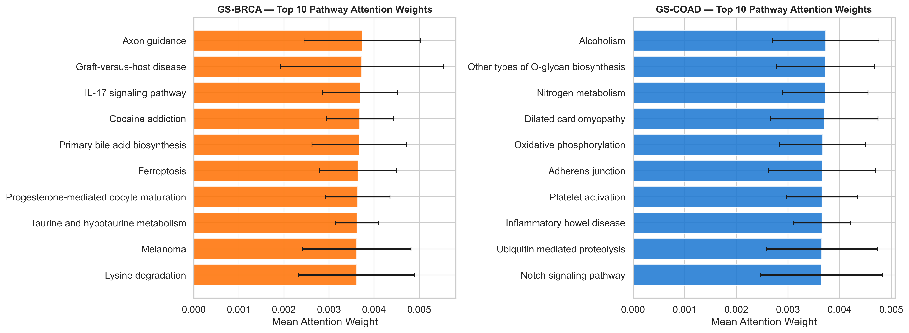</td>
<td align="center" width="50%">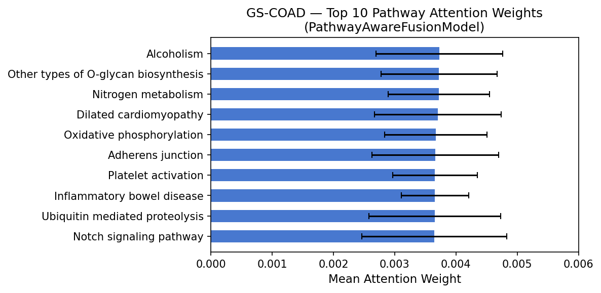</td>
</tr>
<tr>
<td colspan="2" align="center"><em>Top-10 KEGG pathway attention weights from PathwayAwareFusion. Weights are nearly uniform (0.003–0.004 range), indicating the attention mechanism did not learn strong pathway focus with 35–37% KEGG coverage.</em></td>
</tr>
</table>

### Confusion Matrices (Best Fold)

<table align="center" width="100%">
<tr>
<th align="center">IntermediateFusion - GS-BRCA</th>
<th align="center">IntermediateFusion - GS-COAD</th>
</tr>
<tr>
<td align="center">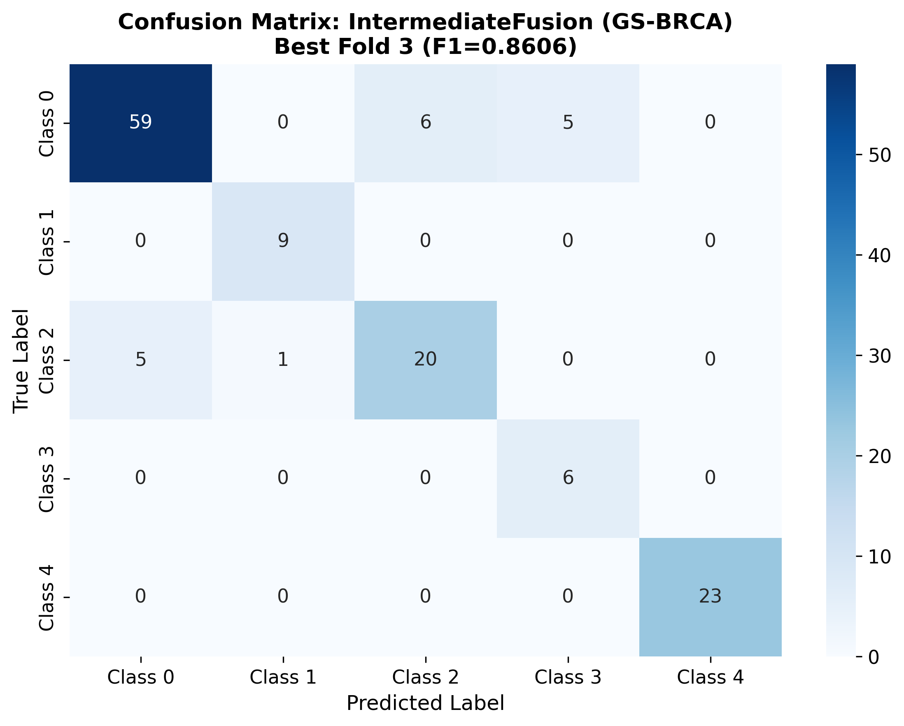</td>
<td align="center">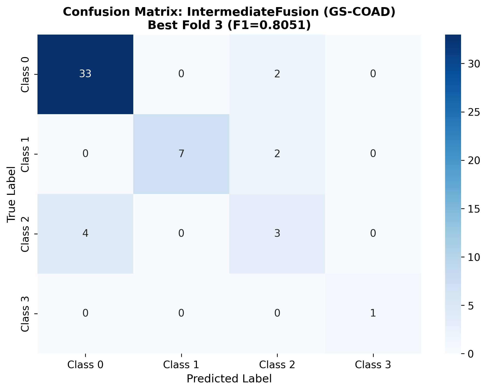</td>
</tr>
<tr>
<td colspan="2" align="center"><em>IntermediateFusion best-fold confusion matrices - GS-BRCA (left) and GS-COAD (right).</em></td>
</tr>
</table>

---

## 🧪 Ablation Studies

### A1 - Modality Removal (IntermediateFusion)

| Removed Modality | BRCA F1 (baseline: 0.808) | COAD F1 (baseline: 0.669) |
|-----------------|:-------------------------:|:-------------------------:|
| mRNA | 0.767 (-0.041) 🔴 | 0.669 (-0.000) |
| miRNA | 0.803 (-0.006) | **0.802 (+0.133)** 🟢 |
| Methylation | 0.788 (-0.020) | 0.732 (+0.063) 🟢 |
| CNV | 0.789 (-0.019) | 0.669 (-0.000) |

> 🚨 **The miRNA Artifact on COAD:** Removing miRNA from COAD *improves* F1 by **+0.133** (0.669 → 0.802). The fusion model over-weights a noisy miRNA signal on the small 260-patient COAD dataset - an **original empirical finding** of this project, well-evidenced by IG attributions (all top-50 features are miRNA) and ablation results.

<p align="center">
  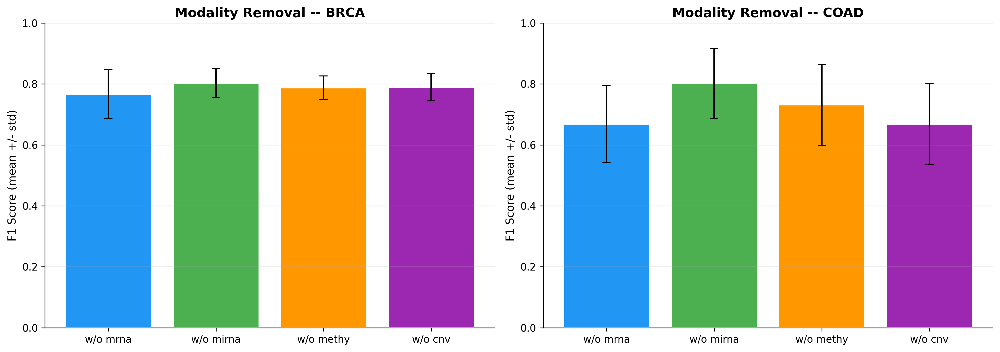
</p>
<p align="center"><em>A1: F1 impact of removing each omics modality from IntermediateFusion. The COAD miRNA bar (green, +0.133) is the largest effect in the entire ablation suite.</em></p>

### A2 - Fusion Strategy Comparison

| Model | BRCA F1 | COAD F1 | Architecture |
|-------|:-------:|:-------:|-------------|
| XGBoost (early, tree) | 0.794 | 0.636 | Concatenated → 300 boosted trees |
| EarlyFusionMLP (early, deep) | 0.722 | **0.751** | Concatenated → 256 → 128 → classes |
| IntermediateFusion (intermediate) | **0.808** | 0.669 | Per-modality encoders → latent cat → MLP |
| PathwayAwareFusion (intermediate+bio) | 0.801 | **0.738** | KEGG-guided mRNA + per-modality encoders |

**Pattern:** Larger data (BRCA, 671 patients) favors modality-specific encoders. Smaller data (COAD, 260 patients) favors simpler architectures - *unless* biological priors are injected (PathwayFusion compensates for data scarcity).

<p align="center">
  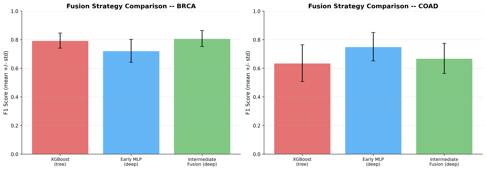
</p>
<p align="center"><em>A2: Fusion strategy comparison across BRCA and COAD - early-fusion tree, early-fusion deep, intermediate fusion, and pathway-aware fusion.</em></p>

### A3 - Missing Modality Robustness

| Missing Data Rate | BRCA F1 | COAD F1 |
|:-----------------:|:-------:|:-------:|
| 0% (complete) | 0.808 | 0.669 |
| 10% | 0.819 | 0.718 |
| 20% | **0.831** | 0.599 |
| 30% | 0.764 | 0.611 |
| 50% | 0.749 | 0.620 |

BRCA: robust up to 20% missingness (F1 actually improves slightly - regularizing effect). COAD: unstable (miRNA artifact + small sample size). Even at 50% missing data, BRCA F1 only drops 7% relative.

<p align="center">
  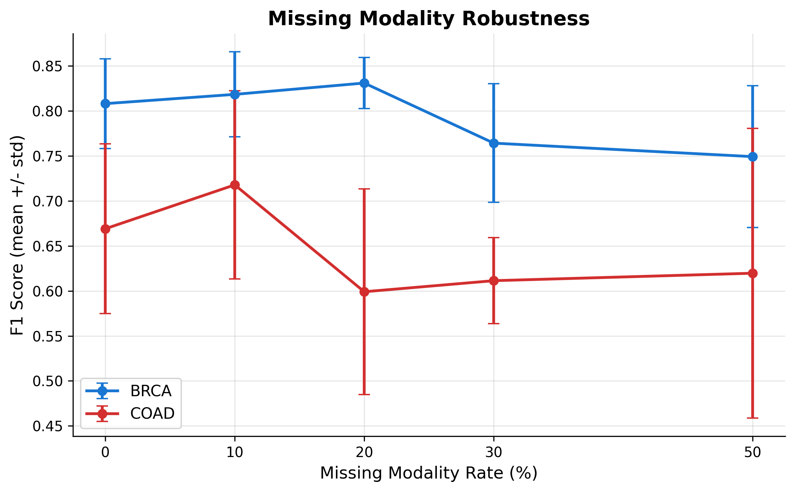
</p>
<p align="center"><em>A3: IntermediateFusion F1 as missing-data rate increases from 0% to 50% - BRCA (blue) vs COAD (orange).</em></p>

### Training Convergence

<table align="center" width="100%">
<tr>
<th align="center">IntermediateFusion Training Curves - GS-BRCA</th>
<th align="center">IntermediateFusion Training Curves - GS-COAD</th>
</tr>
<tr>
<td align="center">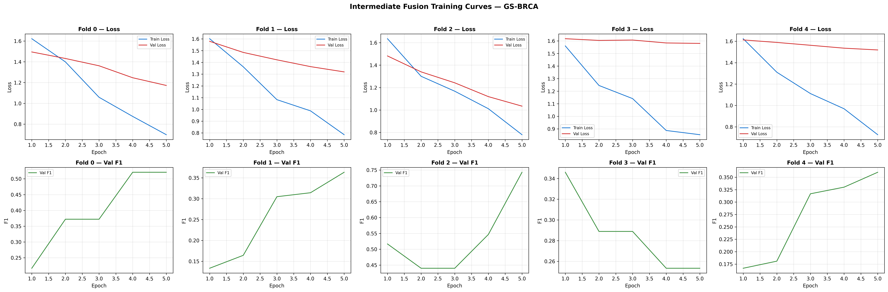</td>
<td align="center">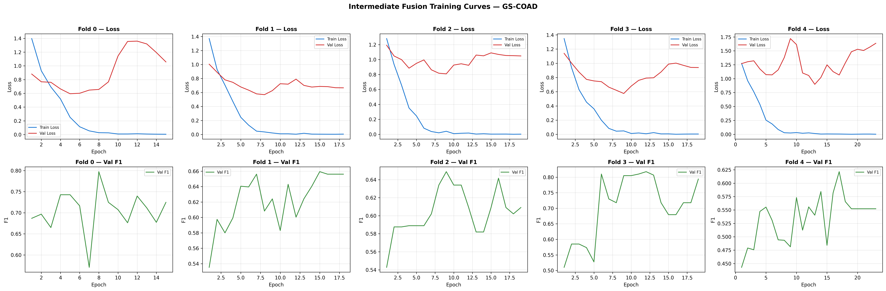</td>
</tr>
<tr>
<td colspan="2" align="center"><em>Training/validation loss curves across 5 folds - GS-BRCA (left) and GS-COAD (right). Early stopping (patience=10) is visible as different fold lengths.</em></td>
</tr>
</table>

---

## 🖥️ Streamlit Demo Application

```bash
streamlit run app/streamlit_app.py   # Launches at http://localhost:8501
```

A **~3,875-line** single-page Streamlit app with sidebar cancer/model selectors and three functional tabs:

### Tab 1 - 🔮 Prediction

Upload a patient CSV (features × samples format; sample files provided for both cancers). The app:

1. Validates format & preprocesses with training-time scalers/imputers
2. Runs selected model (XGBoost / IntermediateFusion / PathwayAwareFusion)
3. Returns predicted subtype with **confidence % and confidence tier** (HIGH >80% 🟢 · MODERATE 50–80% 🔵 · LOW <50% 🟡)
4. Shows feature attribution (SHAP waterfall for XGBoost · IG bar chart for fusion models, colour-coded by modality)
5. Shows **Pathway-Level Attention Weights** (PathwayAwareFusion only) - top-10 KEGG pathways
6. Optional **Groq AI Research Summary** - LLM-generated clinical context if `GROQ_API_KEY` is set
7. Batch prediction support - upload multiple patients, download all predictions as CSV
8. **Live IG computation via Captum** as fallback when precomputed attributions are unavailable

### Tab 2 - 📊 Model Comparison

No upload required. Displays:

- Trophy banner + highlight metric cards (Best F1, Precision, Recall, AUC)
- Full metrics table (styled, min/max highlighting)
- Grouped Plotly bar charts (F1/AUC by model × cancer)
- Per-fold ROC curves (macro-averaged OVR, all 4 models)
- Per-fold AUC breakdown table
- Radar chart (F1, Precision, Recall, AUC, NMI, ARI)
- Latent space t-SNE visualization
- Training convergence curves
- Confusion matrices (all 4 deployed models)
- Biological validation (KEGG enrichment, GO enrichment, pathway attention chart)
- Ablation results (modality removal, fusion comparison, missing-modality curve)

### Tab 3 - 🧪 Lab Data Converter

Bridges the gap between hospital genomics lab outputs and the prediction pipeline:

1. **Upload** up to 4 separate per-modality lab CSV files (any combination)
2. **Select data format** - supports 4 clinical export types:
   - Already z-score normalized → used as-is
   - Log2-transformed → robust single-sample z-scoring (median + IQR/1.349)
   - Raw counts (RNA-seq) → log2(x+1), then z-scoring
   - Beta values 0–1 (methylation arrays) → M-value transform, then z-scoring
3. **Auto-mapping** - detects CSV orientation, normalizes miRNA names (hsa-miR-21 → hsa.mir.21)
4. **Coverage report** - % of expected features matched per modality with status tiers
5. **Download** prediction-ready CSV directly uploadable in Tab 1

<details>
<summary><strong>📁 Pre-built Test Datasets (35 files)</strong></summary>

## Pre-built Test Datasets (`app/test_datasets/`)

| Category | Files | Source | Use Case |
|----------|:-----:|--------|---------|
| 📁 `test/` | 13 | Real TCGA held-out patients | Ground truth validation |
| 📁 `synthetic/` | 14 | Statistically generated from class distributions | Stress testing |
| 📁 `demo/` | 8 | Named patients with clinical backstories | Demos & presentations |

**Named demo patients:**

- 👩 **Sarah Mitchell** - Luminal A BRCA (`demo_patient_sarah_mitchell_BRCA.csv`)
- 👨 **Robert Okonkwo** - CMS2 COAD (`demo_patient_robert_okonkwo_COAD.csv`)
- 👩 **Amara Nwosu** - 4 separate lab-format files for Data Converter workflow testing

</details>

<details>
<summary><strong>📦 Precomputed Demo Artifacts (27 files in app/model_artifacts/)</strong></summary>

## Precomputed Demo Artifacts

| Artifact | Description |
|---------|-------------|
| `config_{brca,coad}.json` | Feature names, class labels, modality dims, best-fold indices |
| `xgb_best_{brca,coad}.pkl` | Best-fold XGBoost checkpoints |
| `fusion_best_{brca,coad}.pt` | Best-fold IntermediateFusion PyTorch checkpoints |
| `pathway_fusion_best_{brca,coad}.pt` | Best-fold PathwayAwareFusion PyTorch checkpoints |
| `per_modality_scaler_{brca,coad}.pkl` | PerModalityScaler fitted on best training fold |
| `imputer_{brca,coad}.pkl` | PerModalityImputer fitted on best training fold |
| `pathway_gene_mapping.json` | KEGG pathway → mRNA feature index mapping |
| `latent_space_data_{brca,coad}.json` | Pre-computed t-SNE embeddings |
| `fusion_attribution_results_{brca,coad}.json` | Pre-computed IG attributions (IntermediateFusion) |
| `pathway_fusion_attribution_results_{brca,coad}.json` | Pre-computed IG attributions (PathwayAwareFusion) |
| `*.npz` | Raw IG attribution arrays (both models × both cancers) |

</details>

---

<details>
<summary><strong>💻 Computational Requirements</strong></summary>

## 💻 Computational Requirements

**Hardware target:** Intel Core i7 11th Gen · 16 GB RAM · NVIDIA 4 GB VRAM · Windows 11

### Toy-Data Benchmarks (CPU only, measured by `scripts/measure_runtime.py`)

| Model | Train Time (10 ep) | Inference Latency | Peak Memory | Parameters |
|-------|:-----------------:|:-----------------:|:-----------:|:----------:|
| XGBoost | 2.35 s | **6.112 ms** | 0.0 MB | N/A (50 trees) |
| Random Forest | 0.85 s | **7.280 ms** | 0.4 MB | N/A (100 trees) |
| IntermediateFusion | 6.14 s | **1.735 ms** | 62.6 MB | **4,036,613** |
| PathwayAwareFusion | 1.53 s | **14.695 ms** | 0.3 MB | **3,656,252** |

### Full-Data 5-Fold CV (GPU-accelerated estimate)

| Model | Approximate Time per Cancer |
|-------|:---------------------------:|
| XGBoost / RandomForest | 5–15 min |
| IntermediateFusion | 20–40 min |
| PathwayAwareFusion | 25–50 min |

> Source: `results/metrics/runtime_summary.csv`

</details>

---

<details>
<summary><strong>📂 Project Structure - annotated file tree</strong></summary>

## 📂 Project Structure

```
multi-omics-cancer-subtype-classifier/
│
├── 📁 app/                          # Streamlit demo application (~3,875 lines)
│   ├── streamlit_app.py             # 3 tabs: Prediction, Model Comparison, Data Converter
│   ├── model_artifacts/             # 27 pre-trained models, scalers, IG attributions
│   ├── sample_input_brca.csv        # Ready-to-upload BRCA sample
│   ├── sample_input_coad.csv        # Ready-to-upload COAD sample
│   └── test_datasets/               # 35 test files (real TCGA, synthetic, demo)
│       ├── test/                    # 13 real TCGA held-out patients
│       ├── synthetic/               # 14 statistically generated patients
│       └── demo/                    # 8 named patients with data cards
│
├── 📁 data/                         # Data directory
│   ├── raw/                         # ⛔ Gitignored - download from Figshare
│   ├── preprocessed/                # ⛔ Gitignored - regenerated in-memory
│   ├── toy/                         # ✅ Committed - 50-sample BRCA subset (6 files)
│   ├── cv_folds.json                # ✅ Canonical 5-fold splits (fixed for all models)
│   ├── sample_map.csv               # 931 samples × 4 modalities
│   ├── dropped_samples.csv          # 0 samples dropped
│   └── DATA_README.md               # Download instructions + checksums
│
├── 📁 docs/                         # Project documentation (6 files)
│   ├── PROJECT_SNAPSHOT.md          # Comprehensive project snapshot (rev 14)
│   ├── PROJECT_STORY.md             # Non-technical narrative overview
│   ├── DATA_CARD.md                 # Datasheets-for-Datasets format
│   ├── preprocessing_verification_report.md  # 46/49 checks pass
│   ├── PRESENTATION_NARRATION.md    # Defense presentation script
│   └── PROJECT_FILE_TREE.md         # Annotated full file tree
│
├── 📁 models/                       # 40 saved model checkpoints
│   ├── baseline_xgb/                # 10 files (5 BRCA + 5 COAD folds)
│   ├── baseline_rf/                 # 10 files
│   ├── intermediate_fusion/         # 10 .pt files
│   └── pathway_fusion/              # 10 .pt files
│
├── 📁 notebooks/                    # 7 Jupyter notebooks
│   ├── 00_data_inspect.ipynb        # EDA, shape checks, class distributions
│   ├── 01_preprocessing.ipynb       # Preprocessing pipeline + 49-check verification
│   ├── 02_baselines.ipynb           # XGBoost + RF training + SHAP
│   ├── 03_latent_fusion.ipynb       # IntermediateFusion training + model comparison
│   ├── 04_explainability.ipynb      # SHAP + IG + KEGG/GO enrichment
│   ├── 04b_ablations.ipynb          # Modality removal + missing-data curves
│   └── 04.5_pathway_fusion.ipynb    # PathwayAwareFusion experiment
│
├── 📁 results/                      # 175 results files
│   ├── metrics/                     # 17 CSVs + 40 NPZ (model comparison, AUC, significance, runtime)
│   ├── plots/                       # 52 plots (ROC curves, confusion matrices, training curves)
│   ├── shap/                        # 37 SHAP files (xgb/ · rf/ · fusion/)
│   ├── enrichment/                  # 22 KEGG/GO enrichment files
│   ├── calibration/                 # 9 files (ECE/MCE/Brier + reliability diagrams)
│   └── qc/                          # 2 QC JSON reports
│
├── 📁 scripts/                      # 24 Python scripts
│   ├── train_baselines.py           # XGBoost + RF 5-fold CV
│   ├── train_fusion.py              # IntermediateFusion 5-fold CV
│   ├── train_pathway_fusion.py      # PathwayAwareFusion 5-fold CV
│   ├── run_explainability.py        # Full explainability pipeline
│   ├── run_ablations.py             # All 3 ablation experiments
│   ├── compute_auc.py               # AUC from all 40 models
│   ├── compute_significance_tests.py # Wilcoxon + Cohen's d
│   ├── calibration_analysis.py      # ECE, MCE, Brier score
│   ├── generate_roc_curves.py       # Per-fold ROC curves (BRCA)
│   ├── generate_roc_curves_coad.py  # Per-fold ROC curves (COAD)
│   ├── measure_runtime.py           # Benchmark inference latency
│   ├── prepare_demo_artifacts.py    # Export best-fold models for Streamlit
│   ├── precompute_fusion_attribution.py  # Pre-compute IG attributions
│   ├── precompute_latent_space.py   # Pre-compute t-SNE embeddings
│   ├── create_demo_patients.py      # Sarah Mitchell + Robert Okonkwo
│   ├── create_lab_patient_files.py  # Amara Nwosu lab-format files
│   ├── create_synthetic_patients.py # Statistical synthetic patients
│   ├── create_test_datasets.py      # Real TCGA test files
│   ├── prepare_real_patient_upload.py  # CLI batch data converter
│   ├── create_toy_dataset.py        # 50-sample BRCA toy subset
│   ├── verify_label_alignment.py    # SHA-256 checksum guards
│   └── validate_artifacts.py        # Demo artifact consistency check
│
├── 📁 src/                          # 7 core modules (~2,235 lines)
│   ├── utils.py                     # set_seeds(), load_config(), log_experiment(), get_device()
│   ├── data_loader.py               # load_modality(), load_labels(), get_common_samples()
│   ├── preprocessing.py             # PerModalityImputer, PerModalityScaler, prepare_fold_data()
│   ├── models.py                    # All 5 model classes + MultiOmicsDataset
│   ├── evaluation.py                # compute_metrics(), fold summary, save_metrics()
│   ├── explainability.py            # SHAP, Integrated Gradients, KEGG/GO enrichment
│   └── patient_converter.py         # Lab CSV → prediction-ready row (4 format transforms)
│
├── 📁 tests/                        # 10 test modules, 32 tests (all pass)
│   ├── test_models.py               # Model shapes, forward passes, attention normalization
│   ├── test_preprocessing.py        # Imputer, scaler, fold data integrity
│   ├── test_data_loader.py          # Data loading, label alignment
│   ├── test_cv_folds.py             # No train/val overlap, all samples assigned
│   ├── test_evaluation.py           # Metric keys and ranges
│   ├── test_utils.py                # Seed reproducibility, config, logging
│   ├── test_label_alignment.py      # Label count, order, SHA-256 checksum guard
│   ├── test_save_load_roundtrip.py  # Model checkpoint save/load (atol=1e-6)
│   ├── test_cv_folds_enforcement.py # AST check: training scripts use load_cv_folds()
│   └── test_dashboard_preprocessing_equivalence.py  # Inference preprocessing = training preprocessing
│
├── .github/workflows/ci.yml         # GitHub Actions CI (test + lint jobs)
├── config.yaml                      # 🔑 Single source of truth - all hyperparameters
├── requirements.txt                 # 150 pinned packages
├── experiment_log.csv               # 130 canonical experiment rows
├── CHANGELOG.md                     # v0.0-scaffold → v1.1-audit release history
└── LICENSE                          # MIT License
```

### Notebooks Execution Order

```
00_data_inspect → 01_preprocessing → 02_baselines → 03_latent_fusion
                                                            ↓
                                   04.5_pathway_fusion ← 04_explainability ← 04b_ablations
```

</details>

---

## 🛠️ Tech Stack

| Category | Technology | Version |
|----------|------------|:-------:|
| **Language** | Python |  |
| **Deep Learning** | PyTorch + CUDA |  |
| **ML Baselines** | XGBoost |  |
| **ML Utilities** | scikit-learn |  |
| **Explainability** | SHAP |  |
| **Deep Attribution** | Captum (Integrated Gradients) |  |
| **Pathway Analysis** | gseapy (KEGG + GO via Enrichr) |  |
| **Demo App** | Streamlit |  |
| **AI Summaries** | Groq SDK |  |
| **Visualisation** | Plotly + Matplotlib + Seaborn |    |
| **Notebooks** | JupyterLab |  |
| **Data** | NumPy + Pandas |   |
| **CI/CD** | GitHub Actions |  |

---

## 🔬 Key Scientific Findings

> These are the **original empirical contributions** of this project:

1. **🏆 Pathway priors rescue small datasets.** PathwayAwareFusion achieves F1=0.738 on 260-patient COAD, a **+6.9% improvement** over IntermediateFusion - the largest gain in the project - precisely where data was scarcest. The KEGG biological prior compensated for limited training samples. On larger BRCA (671 patients), the gain was negligible (-0.008).

2. **🚨 The miRNA artifact.** Removing miRNA from IntermediateFusion COAD *improves* F1 from 0.669 to **0.802 (+0.133)**. A modality was actively harming performance. IG attributions confirm: all top-50 features are miRNA, exposing over-weighting of a noisy 200-feature module on a 260-sample dataset. This is a **genuine negative finding** with strong quantitative evidence.

3. **⚖️ Deep learning ≈ XGBoost at sufficient scale.** IntermediateFusion vs XGBoost on BRCA: ΔF1=+0.014, p=0.625, Cohen's d=0.197 (trivial). The deep architecture with 4M parameters is statistically indistinguishable from 300 gradient-boosted trees on this 671-patient dataset.

4. **📊 AUC, F1, and calibration tell three different stories.** Random Forest achieves the best AUC (0.971) yet the worst F1 (0.602) and worst calibration (ECE=0.145) on BRCA. XGBoost ranks second in both AUC and F1, but best in calibration (ECE=0.068). No single metric is sufficient for evaluating medical AI. The triple-metric split - where ranking ability, decision quality, and confidence reliability disagree - is a core thesis discussion point. See the [Calibration Analysis](#-calibration-analysis) section.

5. **🧬 Biologically plausible enrichment for BRCA.** KEGG cell cycle (p=3.07×10⁻⁵) and p53 signaling (p=1.29×10⁻²) enriched from IntermediateFusion BRCA IG features - known cancer driver pathways. 57 significant GO terms, all mitosis-related. Zero enrichment found for XGBoost or any COAD model.

6. **📉 Simpler is sometimes better.** EarlyFusionMLP (one MLP, early concat) beats IntermediateFusion on COAD (0.751 vs 0.669). The modality-separation advantage requires sufficient data per modality per encoder.

7. **🛡️ BRCA robustness under missingness.** At 20% missing data, BRCA F1 actually *improves* to 0.831 (a mild regularization effect). At 50% missingness, F1 is still 0.749 - only 7% relative decline from the 0.808 baseline.

---

## ⚠️ Known Limitations

| # | Issue | Impact | Documentation |
|---|-------|--------|---------------|
| 1 | **Global ANOVA feature pre-selection** - top features chosen from ALL samples before CV splitting; mild label leakage | All F1 scores slightly inflated; label shuffle gives F1=0.38 (BRCA) and 0.53 (COAD) vs expected 0.20/0.25 | `docs/DATA_CARD.md`, preprocessing report |
| 2 | **miRNA over-weighting on COAD** - miRNA removal improves F1 by +0.133 | IntermediateFusion COAD results artificially deflated | `results/metrics/ablation_modality_removal.csv` |
| 3 | **CMS4 has only 4 patients** - some folds contain zero CMS4 samples | COAD fold 0 AUC = NaN; per-class COAD metrics unreliable | `results/metrics/auc_scores.csv` |
| 4 | **High COAD variance** - F1 std 0.09–0.14 vs BRCA 0.05–0.07 | Small dataset instability; PathwayFusion COAD F1 std=0.142 | `model_comparison.csv` |
| 5 | **BRCA miRNA 45.4% NaN** - 166/366 probes not assayed | miRNA signal incomplete for BRCA | `PerModalityImputer` zero-fills |
| 6 | **Pathway attention weights nearly uniform** (0.003–0.004 range) | Attention mechanism did not learn strong pathway focus; limited KEGG coverage (35–37%) | `results/enrichment/pathway_attention_scores.csv` |
| 7 | **No independent test set** - all metrics from 5-fold CV | Performance estimates not validated on independent cohorts | All results sections |
| 8 | **Single-sample normalisation is approximate** | Lab Data Converter cannot correct batch effects between sequencing platforms | Data Converter tab warning |

---

<details>
<summary><strong>🏛️ Reproducibility Guarantees</strong></summary>

## 🏛️ Reproducibility Guarantees

This project is engineered for full reproducibility:

- **`set_seeds(42)`** sets Python/NumPy/PyTorch/CUDA random state on every run
- **`data/cv_folds.json`** - fold assignments fixed once and never regenerated; all 5 models use identical splits
- **`config.yaml`** - all hyperparameters in one place; nothing hardcoded in scripts
- **`experiment_log.csv`** - 130 canonical rows; every run logged with full provenance
- **Scalers fit on train folds only** - enforced by `prepare_fold_data()` + tests in `test_preprocessing.py`
- **`test_cv_folds.py`** asserts zero train/val overlap across all 10 folds
- **`test_dashboard_preprocessing_equivalence.py`** verifies inference preprocessing = training preprocessing

```bash
PYTHONHASHSEED=42 python scripts/train_fusion.py   # Fully deterministic
python -m pytest tests/ -v                          # 32 tests, all pass
```

</details>

---

<details>
<summary><strong>🔁 CI/CD</strong></summary>

## 🔁 CI/CD

GitHub Actions workflow (`.github/workflows/ci.yml`) runs on every push to `dev` and every PR targeting `main`:

| Job | What It Checks |
|-----|---------------|
| **Test Suite** | Full `pytest tests/ -v` with `PYTHONHASHSEED=42` on Python 3.11 (CPU PyTorch) |
| **Import & Syntax Check** | All 7 `src/` modules import cleanly + all 24 scripts compile without syntax errors |

</details>

---

## 📚 Citation & Data

**Dataset:**

```bibtex
@dataset{mlomics_figshare,
  title  = {MLOmics: Cancer Multi-Omics Database for Machine Learning},
  doi    = {10.6084/m9.figshare.28729127},
  note   = {CC BY 4.0. Upstream source: The Cancer Genome Atlas (TCGA)}
}
```

**TCGA Breast Cancer:**

```bibtex
@article{tcga_brca_2013,
  author  = {{The Cancer Genome Atlas Research Network}},
  title   = {Comprehensive molecular portraits of human breast tumours},
  journal = {Nature},
  volume  = {490},
  pages   = {61--70},
  year    = {2013}
}
```

---

<details>
<summary><strong>🗂️ Changelog Highlights</strong></summary>

## 🗂️ Changelog Highlights

| Tag | Date | Milestone |
|-----|------|-----------|
| `v0.0-scaffold` | 2026-02-26 | Initial repo structure, config, utils |
| `v0.1-preprocessing` | 2026-02-27 | PerModalityScaler, CV folds, 49-check verification |
| `v0.2-baselines` | 2026-03-03 | XGBoost + RandomForest 5-fold CV + SHAP |
| `v0.3-fusion` | 2026-03-04 | IntermediateFusionModel (BRCA F1=0.81) |
| `v0.4-analysis` | 2026-03-06 | Explainability (SHAP + IG + KEGG/GO) + Ablations |
| `v0.5-demo` | 2026-04-12 | Dual-cancer Streamlit app + per-fold AUC + ROC curves |
| `v1.0-final` | 2026-04-29 | All deliverables complete for submission |
| `v1.1-audit` | 2026-05-07 | Post-submission audit: calibration, significance tests, runtime, label checksums |
| `v1.2-pathway-fusion` | 2026-05-14 | PathwayAwareFusion IG wiring + pathway attention chart + live IG fallback |
| `v1.3-ci` | 2026-05-15 | GitHub Actions CI/CD + COAD pathway attention visualization |

</details>

---

## 👤 Author

<table>
<tr>
<td align="center">
<strong>Dineth Hettiarachchi</strong><br>
BSc (Hons) Computer Science - Final Year Project<br>
NSBM Green University · Department of Computer Science<br>
<em>in partnership with University of Plymouth, UK</em><br><br>
<strong>Hardware:</strong> ASUS Vivobook - i7 11th Gen, 16 GB RAM, 4 GB VRAM, Windows 11
</td>
</tr>
</table>

---

<div align="center">

**Keywords:** multi-omics cancer classification · deep learning cancer subtype prediction · intermediate fusion neural network · pathway attention encoder · KEGG pathway analysis · TCGA breast cancer · BRCA molecular subtypes · colon cancer CMS subtypes · SHAP explainability · Integrated Gradients · cancer genomics machine learning · PyTorch bioinformatics · multi-modal data fusion · precision oncology · computational pathology · XGBoost genomics · cancer subtype classifier · mRNA miRNA methylation CNV integration · 5-fold cross-validation genomics · Streamlit bioinformatics demo

---

*Academic research prototype. Not for clinical use.*  
*Data source: MLOmics benchmark (TCGA origin, CC-BY-4.0)*  
*Tagged v1.0-final on April 29, 2026.*

[](https://github.com/deaneeth/multi-omics-cancer-subtype-classifier)
[](https://github.com/deaneeth/multi-omics-cancer-subtype-classifier)

</div>
